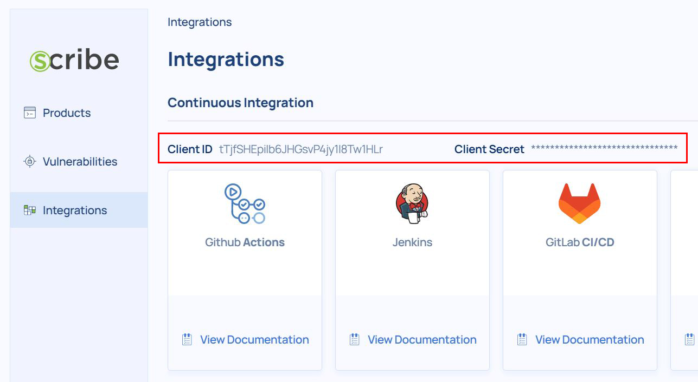

# Bitbucket Pipelines Pipe: Scribe evidence generator
Scribe support evidence collecting and integrity verification for Bitbucket pipelines.

### YAML Definition

Add the following snippet to the script section of your `bitbucket-pipelines.yml` file:

```yaml
- pipe: scribe-security/valint-pipe:1.3.0
  variables:
    COMMAND_NAME: "<string>" # 'bom', 'slsa', 'evidence' or 'verify'.
    TARGET: "<string>"
    # VERBOSE: "<string>" # Optional
    # CONFIG:"<string>" # Optional
    # FORMAT: "<string>" # Optional
    # INPUT_FORMAT: "<string>" # Optional
    # OUTPUT_DIRECTORY: --output-directory # Optional
    # OUTPUT_FILE: "<string>" # Optional
    # LABEL: "<string>" # Optional
    # ENV: "<string>" # Optional
    # FILTER_REGEX: "<string>" # Optional
    # FILTER_SCOPE: "<string>" # Optional
    # PACKAGE_TYPE: "<string>" # Optional
    # PACKAGE_GROUP: "<string>" # Optional
    # FORCE: --force # Optional
    # GIT_BRANCH: "<string>" # Optional
    # GIT_COMMIT: "<string>" # Optional
    # GIT_TAG: "<string>" # Optional
    # ATTEST_CONFIG: "<string>" # Optional
    # ATTEST_DEFAULT: "<string>" # Optional
    # SCRIBE_ENABLE: "<boolean>" # Optional
    # SCRIBE_CLIENT_ID: "<string>" # Optional
    # SCRIBE_CLIENT_SECRET: "<string>" # Optional
    # ATTESTATION: "<string>" # Optional
    # COMPONENTS: "<string>" # Optional
    # OCI: "<boolean>" # Optional
    # OCI_REPO: "<string>" # Optional
    # BUNDLE: "<string>" # Optional
    # COMMON_NAME: "<string>" # Optional
    # EMAIL: "<string>" # Optional
    # RULE: "<string>" # Optional
    # SKIP_BUNDLE: "<boolean>" # Optional
    # SKIP_REPORT: "<boolean>" # Optional
    # URI: --uri
    # ALLOW_EXPIRED: "<string>" # Optional
    # BACKOFF: "<string>" # Optional
    # CA: "<string>" # Optional
    # CACHE_ENABLE: "<string>" # Optional
    # CERT: "<string>" # Optional
    # KEY: "<string>" # Optional
    # CONTEXT_DIR: "<string>" # Optional
    # CRL: "<string>" # Optional
    # CRL_FULL_CHAIN: "<string>" # Optional
    # DELIVERABLE: "<string>" # Optional
    # DEPTH: "<integer>" # Optional
    # DISABLE_CRL: "<boolean>" # Optional
    # FILTER_SCOPE: "<string>" # Optional
    # GIT_TAG: "<string>" # Optional
    # LEVEL: "<string>" # Optional
    # LOG_CONTEXT: "<string>" # Optional
    # LOG_FILE: "<string>" # Optional
    # PREDICATE_TYPE: "<string>" # Optional
    # PRODUCT_KEY: "<string>" # Optional
    # PRODUCT_VERSION: "<string>" # Optional
    # RULE_ARGS: "<string>" # Optional
    # SCRIBE_AUTH_AUDIENCE: "<string>" # Optional
    # SCRIBE_URL: "<string>" # Optional
    # STRUCTURED: "<string>" # Optional
    # TIMEOUT: "<string>" # Optional
```

### Required Variables

| Variable     | Usage                                    |
| ------------ | ---------------------------------------- |
| COMMAND_NAME | Name of the command to execute (`bom`, `slsa`, `evidence`, `verify`) |

### Common Variables
Flags for all `valint` subcommands

| Variable       | Usage                                                                                                                         | Default             |
| -------------- | ----------------------------------------------------------------------------------------------------------------------------- | ------------------- |
| ALLOW_EXPIRED   | Allow expired certs                                                                                                           |                    |
| ATTEST_CONFIG   | Attestation config path                                                                                                       |                    |
| ATTEST_DEFAULT  | Attestation default config, options=[sigstore sigstore-github x509 x509-env]                                                  | "sigstore"         |
| BACKOFF         | Backoff duration                                                                                                              | "15s"              |
| CA              | x509 CA Chain path                                                                                                            |                    |
| CACHE_ENABLE    | Enable local cache                                                                                                            | true               |
| CERT            | x509 Cert path                                                                                                                |                    |
| CONFIG          | Configuration file path                                                                                                       |                    |
| CONTEXT_DIR     | Context dir                                                                                                                   |                    |
| CONTEXT_TYPE    | CI context type, options=[jenkins github circleci azure gitlab travis tekton bitbucket local]                                 | "local"            |
| CRL             | x509 CRL path                                                                                                                 |                    |
| CRL_FULL_CHAIN  | Enable Full chain CRL verification                                                                                            |                    |
| DELIVERABLE     | Mark as deliverable, options=[true, false]                                                                                    |                    |
| DEPTH           | Git clone depth                                                                                                               |                    |
| DISABLE_CRL     | Disable certificate revocation verification                                                                                   |                    |
| ENV             | Environment keys to include in sbom                                                                                           |                    |
| FILTER_REGEX    | Filter out files by regex                                                                                                     | [**/*.pyc,**/.git/**] |
| FILTER_SCOPE    | Filter packages by scope                                                                                                      |                    |
| GIT_BRANCH      | Git branch in the repository                                                                                                  |                    |
| GIT_COMMIT      | Git commit hash in the repository                                                                                             |                    |
| GIT_TAG         | Git tag in the repository                                                                                                     |                    |
| KEY             | x509 Private key path                                                                                                         |                    |
| LABEL           | Add Custom labels                                                                                                             |                    |
| LEVEL           | Log depth level, options=[panic fatal error warning info debug trace]                                                         |                    |
| LOG_CONTEXT     | Attach context to all logs                                                                                                    |                    |
| LOG_FILE        | Output log to file                                                                                                            |                    |
| OCI             | Enable OCI store                                                                                                              |                    |
| OCI_REPO        | Select OCI custom attestation repo                                                                                            |                    |
| OUTPUT_DIRECTORY| Output directory path                                                                                                         | "${XDG_CACHE_HOME}/valint" | any |
| OUTPUT_FILE     | Output file name                                                                                                              |                    |
| PIPELINE_NAME   | Pipeline name                                                                                                                 |                    |
| PLATFORM        | Select target platform, examples=windows/armv6, arm64 ..)                                                                     |                    |
| POLICY_ARGS     | Policy arguments                                                                                                              | []                 |
| PREDICATE_TYPE  | Custom Predicate type (generic evidence format)                                                                               | "http://scribesecurity.com/evidence/generic/v0.1" | any |
| PRODUCT_KEY     | Product Key                                                                                                                   |                    |
| PRODUCT_VERSION | Product Version                                                                                                               |                    |
| QUIET           | Suppress all logging output                                                                                                   |                    |
| SCRIBE_CLIENT_ID| Scribe Client ID                                                                                                              |                    |
| SCRIBE_CLIENT_SECRET| Scribe Client Secret                                                                                                      |                    |
| SCRIBE_ENABLE   | Enable scribe client                                                                                                          |                    |
| SCRIBE_URL      | Scribe API Url                                                                                                                | "https://api.scribesecurity.com" | any |
| SHOW            | Print evidence to stdout                                                                                                      |                    |
| STRUCTURED      | Enable structured logger                                                                                                      |                    |
| TIMEOUT         | Timeout duration                                                                                                              | "120s"             |
| VERBOSE         | Log verbosity level [-v,--verbose=1] = info, [-vv,--verbose=2] = debug                                                        |                    |

### Bom Command Variables

if `COMMAND` is set to `bom`:

| Variable              | Usage                                                                                                              | Default                                      
| --------------------- | ------------------------------------------------------------------------------------------------------------------ | -------------------------------------------- |
| TARGET (*)      | Target object name format=`[docker:{image:tag}, dir:{dir_path}, git:{git_path}, docker-archive:{archive_path}, oci-archive:archive_path, registry:image:tag`] |
| ATTACH_REGEX          | Attach files content by regex                                                                                      | |
| AUTHOR_EMAIL          | Set author email                                                                                                   | |
| AUTHOR_NAME           | Set author name                                                                                                    | |
| AUTHOR_PHONE          | Set author phone                                                                                                   | |
| COMPONENTS            | Select sbom components groups, options=[metadata layers packages syft files dep commits]                           | [metadata,layers,packages,syft,dep,commits] |
| FORCE                 | Force overwrite cache                                                                                              | |
| FORMAT                | Evidence format, options=[cyclonedx-json cyclonedx-xml attest-cyclonedx-json statement-cyclonedx-json attest-slsa statement-slsa statement-generic attest-generic] | [cyclonedx-json]                            |
| PACKAGE_EXCLUDE_TYPE  | Exclude package type, options=[ruby python javascript java dpkg apk rpm go-module dotnet r-package rust binary sbom nix conan alpm graalvm cocoapods swift dart elixir php erlang github portage haskell kernel] | |
| PACKAGE_GROUP         | Select package group, options=all                                                                                 | |
| PACKAGE_TYPE          | Select package type, options=[ruby python javascript java dpkg apk rpm go-module dotnet r-package rust binary sbom nix conan alpm graalvm cocoapods swift dart elixir php erlang github portage haskell kernel] | [ruby,python,javascript,java,dpkg,apk,rpm,go-module,dotnet,r-package,rust,binary,sbom,nix,conan,alpm,graalvm,cocoapods,swift,dart,elixir,php,erlang,github,portage,haskell,kernel] |
| SUPPLIER_EMAIL        | Set supplier email                                                                                                 | |
| SUPPLIER_NAME         | Set supplier name                                                                                                  | |
| SUPPLIER_PHONE        | Set supplier phone                                                                                                 | |
| SUPPLIER_URL          | Set supplier URL                                                                                                   | |
| (*) = required variable. |                                                                                                                 | |
### SLSA Command Variables

if `COMMAND` is set to `slsa`:

| Variable       | Usage                                                          | Default |
| -------------- | -------------------------------------------------------------- | --- |
| TARGET (*)      | Target object name format=`[docker:{image:tag}, dir:{dir_path}, git:{git_path}, docker-archive:{archive_path}, oci-archive:archive_path, registry:image:tag`]     | |
| ALL_ENV        | Attach all environment variables                               | |
| BUILD_TYPE     | Set build type                                                 | |
| BUILDER_ID     | Set builder id                                                 | |
| BY_PRODUCT     | Attach by product path                                         | |
| COMPONENTS     | Select by products components groups, options=[metadata layers packages syft files dep commits] | |
| EXTERNAL       | Add build external parameters                                  | |
| FINISHED_ON    | Set metadata finished time (YYYY-MM-DDThh:mm:ssZ)              | |
| FORCE          | Force overwrite cache                                          | |
| FORMAT         | Evidence format, options=[statement attest predicate]          | | 
| INVOCATION     | Set metadata invocation ID                                     | |
| PREDICATE      | Import predicate path                                          | |
| STARTED_ON     | Set metadata started time (YYYY-MM-DDThh:mm:ssZ)               | |
| STATEMENT      | Import statement path                                          | |
| (*) = required variable. |                                                      | |

### Evidence Command Variables

if `COMMAND` is set to `evidence`:

| Variable         | Usage                                       | Default |
| ---------------- | ------------------------------------------- | ------- |
| TARGET (*)      | Target object name format=`[file-path] |
| COMPRESS         | Compress content                            |         |
| FORMAT           | Evidence format, options=[statement attest] | [statement] |
| FORMAT_ENCODING  | Format encoding                             |         |
| FORMAT_TYPE      | Format type                                 |         |
| FORMAT_VERSION   | Format version                              |         |
| HELP             | Show help message                           |         |
| TOOL             | Tool name                                   |         |
| TOOL_VENDOR      | Tool vendor                                 |         |
| TOOL_VERSION     | Tool version                                |         |
| (*) = required variable. |                                     |         |

### Verify Command Variables

if `COMMAND` is set to `verify`:

| Variable       | Usage                                                          | Default |
| -------------- | -------------------------------------------------------------- | --- |
| ATTESTATION    | Attestation for target                                         | |
| BUNDLE         | Policy bundle uri/path (early-availability)                   | "https://github.com/scribe-public/sample-policies" |
| COMMON_NAME    | Default policy allowed common names                            | |
| EMAIL          | Default policy allowed emails                                  | |
| FORCE          | Force skip cache                                               | |
| HELP           | Show help message                                              | |
| INPUT_FORMAT   | Evidence format, options=[attest-cyclonedx-json attest-slsa statement-slsa statement-cyclonedx-json statement-generic attest-generic] | "attest-cyclonedx-json" |
| RULE           | Rule configuration file path (early-availability)             | |
| SKIP_BUNDLE    | Skip bundle download                                           | |
| SKIP_REPORT    | Skip Policy report stage                                       | |
| URI            | Default policy allowed uris                                    | |

### Usage

```yaml
 - pipe: scribe-security/valint-pipe:1.3.0
   variables:
    COMMAND_NAME: bom
    TARGET: busybox:latest
    VERBOSE: 2
    FORCE: "true"
```

### Target types - `[target]`

---

Target types are types of artifacts produced and consumed by your supply chain.
Using supported targets, you can collect evidence and verify compliance on a range of artifacts.

> Fields specified as [target] support the following format.

### Format

`[scheme]:[name]:[tag]`

| Sources        | target-type | scheme         | Description                                                     | example                                   |
| -------------- | ----------- | -------------- | --------------------------------------------------------------- | ----------------------------------------- |
| Docker Daemon  | image       | docker         | use the Docker daemon                                           | docker:busybox:latest                     |
| OCI registry   | image       | registry       | use the docker registry directly                                | registry:busybox:latest                   |
| Docker archive | image       | docker-archive | use a tarball from disk for archives created from "docker save" | image                                     |
| OCI archive    | image       | oci-archive    | tarball from disk for OCI archives                              | oci-archive:path/to/yourimage.tar         |
| Remote git     | git         | git            | remote repository git                                           | git:https://github.com/yourrepository.git |
| Local git      | git         | git            | local repository git                                            | git:path/to/yourrepository                |
| Directory      | dir         | dir            | directory path on disk                                          | dir:path/to/yourproject                   |
| File           | file        | file           | file path on disk                                               | file:path/to/yourproject/file             |

### Evidence Stores

Each storer can be used to store, find and download evidence, unifying all the supply chain evidence into a system is an important part to be able to query any subset for policy validation.

| Type   | Description                                 | requirement              |
| ------ | ------------------------------------------- | ------------------------ |
| scribe | Evidence is stored on scribe service        | scribe credentials       |
| OCI    | Evidence is stored on a remote OCI registry | access to a OCI registry |

### Scribe Evidence store

Scribe evidence store allows you store evidence using scribe Service.

Related Flags:

> Note the flag set:
>
> * `SCRIBE_CLIENT_ID`
> * `SCRIBE_CLIENT_ID`
> * `SCRIBE_ENABLE`

### Before you begin

Integrating Scribe Hub with your environment requires the following credentials that are found in the **Integrations** page. (In your **[Scribe Hub](https://scribehub.scribesecurity.com/ "Scribe Hub Link")** go to **integrations**)

* **Client ID**
* **Client Secret**



* Set your Scribe credentials as environment variables according to **[Bitbucket instructions](https://support.atlassian.com/bitbucket-cloud/docs/variables-and-secrets/ "Bitbucket instructions")**.
* Use the Scribe custom pipe as shown in the example bellow

### Usage

```yaml
pipelines:
  default:
    - step:
        name: scribe-bitbucket-pipeline
        script:    
          - pipe: scribe-security/valint-pipe:1.3.0
            variables:
              COMMAND_NAME: [bom,slsa,evidence]
              TARGET:  [target]
              FORMAT: [attest, statement]
              SCRIBE_ENABLE: true
              SCRIBE_CLIENT_ID: $SCRIBE_CLIENT_ID
              SCRIBE_CLIENT_SECRET: $SCRIBE_CLIENT_SECRET

          - pipe: scribe-security/valint-pipe:1.3.0
            variables:
              COMMAND_NAME: verify
              TARGET:  [target]
              INPUT_FORMAT: [attest, statement, attest-slsa, statement-slsa, attest-generic, statement-generic]
              SCRIBE_ENABLE: true
              SCRIBE_CLIENT_ID: $SCRIBE_CLIENT_ID
              SCRIBE_CLIENT_SECRET: $SCRIBE_CLIENT_SECRET
```

### Alternative evidence stores

> You can learn more about alternative stores **[here](https://scribe-security.netlify.app/docs/integrating-scribe/other-evidence-stores)**.

<details>
  <summary> <b> OCI Evidence store </b></summary>
Valint supports both storage and verification flows for `attestations`  and `statement` objects utilizing OCI registry as an evidence store.

Using OCI registry as an evidence store allows you to upload, download and verify evidence across your supply chain in a seamless manner.

Related flags:

* `OCI` Enable OCI store.
* `OCI_REPO` - Evidence store location.

### Before you begin

Evidence can be stored in any accusable registry.

* Write access is required for upload (generate).
* Read access is required for download (verify).

You must first login with the required access privileges to your registry before calling Valint.
For example, using `docker login` command.

### Usage

```yaml
pipelines:
  default:
    - step:
        name: scribe-bitbucket-oci-pipeline
        script:    
          - docker login -u $DOCKER_USERNAME -p $DOCKER_PASSWORD [my_registry]
          - pipe: scribe-security/valint-pipe:1.3.0
            variables:
              COMMAND_NAME: [bom,slsa,evidence]
              TARGET:  [target]
              FORMAT: [attest, statement]
              OCI: true
              OCI_REPO: [oci_repo]

          - pipe: scribe-security/valint-pipe:1.3.0
            variables:
              COMMAND_NAME: verify
              TARGET:  [target]
              INPUT_FORMAT: [attest, statement, attest-slsa, statement-slsa, attest-generic, statement-generic]
              OCI: true
              OCI_REPO: [oci_repo]
```

</details>

## Basic examples

### Public registry image (SBOM)

Create SBOM from remote `busybox:latest` image.

```YAML
  - pipe: scribe-security/valint-pipe:1.3.0
      variables:
        COMMAND: bom
        TARGET: busybox:latest
        FORCE: "true"
```

### Public registry image (SLSA)

Create slsa from remote `busybox:latest` image.

```YAML
  - pipe: scribe-security/valint-pipe:1.3.0
      variables:
        COMMAND: slsa
        TARGET: busybox:latest
```

### Attach third-parth Evidence (Evidence)

Include some third-parth tool as evidence

```YAML
  - pipe: scribe-security/valint-pipe:1.3.0
      variables:
        COMMAND: evidence
        TARGET: some_security_report.json
```

### Docker built image (SBOM)

Create SBOM for image built by local docker `image_name:latest` image.

```YAML
- pipe: scribe-security/valint-pipe:1.3.0
  variables:
    COMMAND: bom
    TARGET: image_name:latest
    VERBOSE: 2
    FORCE: "true"
```

### Docker built image (SLSA)

Create SLSA for image built by local docker `image_name:latest` image.

```YAML
- pipe: scribe-security/valint-pipe:1.3.0
  variables:
    COMMAND: slsa
    TARGET: image_name:latest
    FORCE: "true"
```

### Private registry image (SBOM)

Create SBOM for image hosted on private registry.

> Use `docker login` to add access.

```YAML
- pipe: scribe-security/valint-pipe:1.3.0
  variables:
    COMMAND: bom
    TARGET: scribesecurity.jfrog.io/scribe-docker-local/example:latest
    FORCE: true
```

### Private registry image (SLSA)

Create SLSA for image hosted on private registry.

> Use `docker login` to add access.

```YAML
- pipe: scribe-security/valint-pipe:1.3.0
  variables:
    COMMAND: slsa
    TARGET: scribesecurity.jfrog.io/scribe-docker-local/example:latest
    FORCE: true
    VERBOSE: 2
```

### Custom metadata (SBOM)

Custom metadata added to SBOM.

```YAML
- step:
    name: valint-image-step
    script:
      - export test_env=test_env_value
      - pipe: docker://scribesecuriy.jfrog.io/scribe-docker-public-local/valint-pipe:dev-latest
        variables:
          COMMAND_NAME: bom
          TARGET: busybox:latest
          FORCE: "true"
          ENV: test_env
          LABEL: test_label
```

### Custom metadata (SLSA)

Custom metadata added to SLSA.

```YAML
- step:
    name: valint-image-step
    script:
      - export test_env=test_env_value
      - pipe: docker://scribesecuriy.jfrog.io/scribe-docker-public-local/valint-pipe:dev-latest
        variables:
          COMMAND_NAME: slsa
          TARGET: busybox:latest
          FORCE: "true"
          ENV: test_env
          LABEL: test_label
```

### Save as artifact SBOM

Using input variable `OUTPUT_DIRECTORY` or `OUTPUT_FILE` to export evidence as an artifact.

> Use input variable `FORMAT` to select between supported formats.

```YAML
- step:
    name: save-artifact-step
    script:
      - pipe: docker://scribesecuriy.jfrog.io/scribe-docker-public-local/valint-pipe:dev-latest
        variables:
          COMMAND_NAME: bom
          OUTPUT_FILE: my_sbom.json
          TARGET: busybox:latest
          FORCE: "true"
    artifacts:
      - scribe/**
      - my_sbom.json
```

### Save as artifact SLSA

Using input variable `OUTPUT_DIRECTORY` or `OUTPUT_FILE` to export evidence as an artifact.

> Use input variable `FORMAT` to select between supported formats.

```YAML
- step:
    name: save-artifact-step
    script:
      - pipe: docker://scribesecuriy.jfrog.io/scribe-docker-public-local/valint-pipe:dev-latest
        variables:
          COMMAND_NAME: slsa
          OUTPUT_FILE: my_slsa.json
          TARGET: busybox:latest
          FORCE: "true"
    artifacts:
      - scribe/**
      - my_sbom.json
```

### Directory target (SBOM)

Create SBOM from a local directory.

```YAML
step:
  name: dir-sbom-step
  script:
  - mkdir testdir
  - echo "test" > testdir/test.txt
  - pipe: scribe-security/valint-pipe:1.3.0
    variables:
      COMMAND: bom
      TARGET: dir:./testdir
      SCRIBE_CLIENT_ID: $SCRIBE_CLIENT_ID
      SCRIBE_CLIENT_SECRET: $SCRIBE_CLIENT_SECRET
```

### Directory target (SLSA)

Create SLSA from a local directory.

```YAML
step:
  name: dir-sbom-step
  script:
  - mkdir testdir
  - echo "test" > testdir/test.txt
  - pipe: scribe-security/valint-pipe:1.3.0
    variables:
      COMMAND: slsa
      TARGET: dir:./testdir
      SCRIBE_CLIENT_ID: $SCRIBE_CLIENT_ID
      SCRIBE_CLIENT_SECRET: $SCRIBE_CLIENT_SECRET
```

### Git target (SBOM)

Create SBOM for `mongo-express` remote git repository.

```YAML
- step:
    name: valint-git-step
    script:
      - pipe: docker://scribesecuriy.jfrog.io/scribe-docker-public-local/valint-pipe:dev-latest
        variables:
          COMMAND_NAME: bom
          TARGET: git:https://github.com/mongo-express/mongo-express.git
          VERBOSE: 2
          FORCE: "true"
```

Create SBOM for local git repository.

```YAML
    - step:
        name: valint-git-step
        script:
          - git clone https://github.com/mongo-express/mongo-express.git scm_mongo_express
          - pipe: docker://scribesecuriy.jfrog.io/scribe-docker-public-local/valint-pipe:dev-latest
            variables:
              COMMAND_NAME: bom
              TARGET: dir:scm_mongo_express
              VERBOSE: 2
              FORCE: "true"
```

### Git target (SLSA)

Create SLSA for `mongo-express` remote git repository.

```YAML
- step:
    name: valint-git-step
    script:
      - pipe: docker://scribesecuriy.jfrog.io/scribe-docker-public-local/valint-pipe:dev-latest
        variables:
          COMMAND_NAME: slsa
          TARGET: git:https://github.com/mongo-express/mongo-express.git
          VERBOSE: 2
          FORCE: "true"
```

Create SLSA for local git repository.

```YAML
    - step:
        name: valint-git-step
        script:
          - git clone https://github.com/mongo-express/mongo-express.git scm_mongo_express
          - pipe: docker://scribesecuriy.jfrog.io/scribe-docker-public-local/valint-pipe:dev-latest
            variables:
              COMMAND_NAME: slsa
              TARGET: dir:scm_mongo_express
              VERBOSE: 2
              FORCE: "true"
```

## Resources
If you're new to Bitbucket pipelines this link should help you get started:

[Bitbucket Pipelines](https://support.atlassian.com/bitbucket-cloud/docs/get-started-with-bitbucket-pipelines/ "Get started with Bitbucket Pipelines") - Get started with Bitbucket Pipelines.

## Support

If you'd like help with this pipe, or you have an issue or a feature request, [let us know](https://github.com/scribe-security/valint-pipe/issues).

If you are reporting an issue, please include:

- the version of the pipe
- relevant logs and error messages
- steps to reproduce

By email or slack, 
[Contact-us](https://scribesecurity.com/contact-us/).

## License

Copyright (c) 2019 Atlassian and others.
Apache 2.0 licensed, see [LICENSE](LICENSE.txt) file.